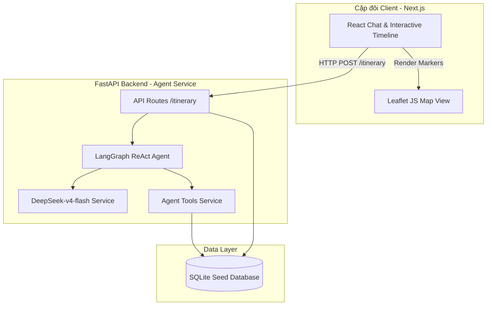
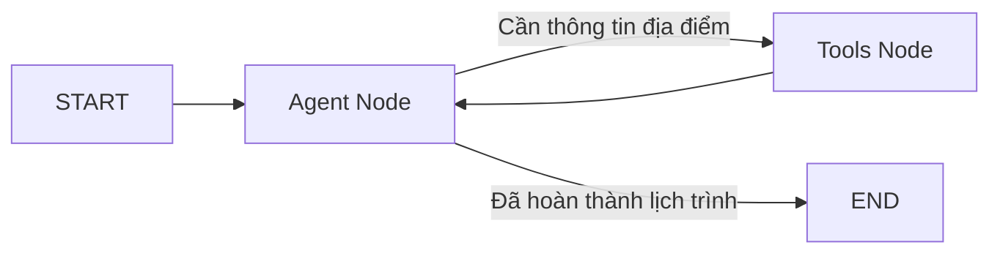
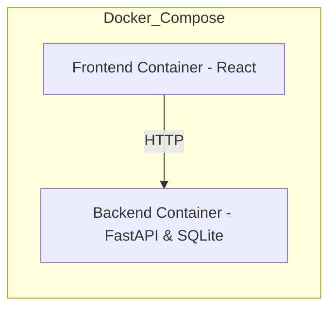

# Architecture Document — Trip-Guilder-Bot (AI Weekend Planner cho Cặp đôi)

## System Overview

Hệ thống sử dụng kiến trúc Client-Server tiêu chuẩn:
- **Frontend (React/Next.js)** cung cấp giao diện trò chuyện lãng mạn kết hợp bản đồ tương tác hiển thị tuyến đường và timeline kéo thả.
- **Backend (FastAPI)** vận hành **LangGraph ReAct Agent** sử dụng mô hình **DeepSeek-v4-flash** để phân tích hội thoại, gọi các công cụ truy vấn dữ liệu địa điểm từ **SQLite seed database** và làm phong phú bằng live API Google Maps/Google Search.

## Architecture Diagram



## Components

### 1. Frontend (React/Next.js)
- **Purpose:** Giao diện tương tác người dùng, hiển thị khung chat, timeline lịch trình và bản đồ động.
- **Key Features:**
  - Chatbox hỗ trợ đề xuất nhanh các vibe hẹn hò (Lãng mạn, Năng động, Ẩm thực).
  - Bản đồ tương tác (Leaflet JS/Google Maps iframe) hiển thị thứ tự di chuyển của cặp đôi.
  - Timeline kéo thả (drag-and-drop) cho phép cặp đôi tự do sắp xếp lại giờ giấc, đổi quán hoặc xóa điểm.
  - Hiển thị chỉ số lượng người dự kiến (crowd avoidance) để giúp cặp đôi tránh điểm ùn tắc.
  - Nút xuất Calendar tạo file `.ics` tải xuống.
- **State Management:** Sử dụng React Context API hoặc Zustand để đồng bộ trạng thái giữa Chat History, Timeline Lịch trình và Bản đồ.

### 2. Backend (FastAPI)
- **Purpose:** Xử lý API, điều phối Agent và xuất file lịch trình.
- **API Design:** RESTful API (`POST /api/chat`, `POST /api/export-calendar`, `GET /api/spots`).
- **Authentication:** None (Không yêu cầu đăng nhập đối với phiên bản hackathon MVP).

### 3. AI Agent (LangGraph)
- **Agent Type:** ReAct (Reasoning and Acting) Agent sử dụng mô hình **DeepSeek-v4-flash** để thực thi hội thoại nhiều lượt và gọi công cụ động.
- **State Schema:**
  ```python
  class AgentState(TypedDict):
      messages: Annotated[list, add_messages]
      vibe: str              # Vibe buổi hẹn hò (lãng mạn, ấm cúng, năng động,...)
      budget: str            # Ngân sách (thấp, trung bình, cao)
      duration: str          # Thời gian (trong ngày, chiều-tối, 2 ngày 1 đêm)
      itinerary: list[dict]  # Danh sách địa điểm đã chốt cho lịch trình
      confidence_score: float# Mức độ tự tin của Agent (để kích hoạt low-confidence path)
  ```
- **Nodes:**
  - `agent`: Đưa ra suy nghĩ và quyết định gọi Tool hoặc kết luận lịch trình.
  - `tools`: Chạy công cụ được yêu cầu (truy vấn database hoặc API) và trả lại kết quả cho Agent.
- **Flow:**



- **Tools:**
  - `get_new_experience`: Tìm kiếm địa điểm hẹn hò mới mẻ hoặc ngẫu nhiên từ seed DB hoặc shop mới mở từ thương hiệu nổi tiếng ở Hà Nội.
  - `get_favourable_place`: Truy cập seed DB & Google Maps API để lấy các địa điểm lãng mạn có điểm đánh giá trung bình cao cùng bình luận tốt.
  - `get_current_trend`: Kết nối mô-đun dự báo xu hướng của đồng nghiệp (Current Trend) để lấy các điểm check-in đang hot trên mạng xã hội.
  - `map_and_export_trip`: Sắp xếp các điểm hẹn hò theo lộ trình tối ưu khoảng cách, tạo dữ liệu bản đồ và sinh file `.ics`.

### 4. Database
- **Type:** SQLite (Lưu trữ cục bộ, dễ cấu hình và phản hồi cực nhanh).
- **Tables:**
  - `spots`: Lưu ~80 địa điểm hẹn hò được tuyển chọn kỹ lưỡng tại Hà Nội (id, tên, tọa độ, địa chỉ, rating, review_count, vibe, tags, open_hours, crowd_level).
  - `event_logs`: Ghi log kéo thả/chỉnh sửa của người dùng (timestamp, event_type, old_slot, new_slot, spot_id) để làm dữ liệu cải thiện chất lượng gợi ý.
- **Migrations:** SQLite DB được khởi tạo trực tiếp qua script python khởi chạy.

### 5. Vector Store
- **Type:** None/Không sử dụng cho MVP.
- **Purpose:** Tránh sự phức tạp không cần thiết; Agent sử dụng DeepSeek-v4-flash kết hợp truy vấn SQL có cấu trúc để đạt độ chính xác 100% về thông tin địa điểm hẹn hò, tránh hiện tượng ảo ảnh (hallucination) từ RAG thông thường.

## Data Flow

1. Người dùng gửi tin nhắn hoặc chọn nút vibe (ví dụ: "Lãng mạn & Ấm cúng").
2. API route nhận request, tải trạng thái và truyền vào LangGraph Agent.
3. Agent suy nghĩ, gọi công cụ `get_favourable_place` để lọc các quán cafe lãng mạn view hồ từ SQLite DB.
4. Công cụ trả về danh sách, Agent sử dụng DeepSeek-v4-flash để sắp xếp thành timeline hợp lý.
5. Lịch trình JSON gửi về Frontend để render thẻ timeline và vẽ marker bản đồ.
6. Khi user kéo thả thay đổi lịch, Frontend gửi log sự kiện về API `/api/log` và cập nhật bản đồ Leaflet.

## Deployment Architecture



## Security

- API Keys (Google Maps, DeepSeek API) được lưu trữ trong `.env` và không commit lên GitHub.
- Validation đầu vào chặt chẽ thông qua Pydantic schemas của FastAPI.
- Cấu hình CORS an toàn chỉ cho phép frontend kết nối tới backend.

## Design Decisions

| Decision | Choice | Reason |
|----------|--------|--------|
| Framework | FastAPI | Tốc độ nhanh, hỗ trợ async, sinh tài liệu Swagger tự động, type-safe tốt. |
| Agent Framework | LangGraph | Quản lý trạng thái Agent dạng đồ thị cực tốt, hỗ trợ quay lại bước trước (looping) mượt mà. |
| Database | SQLite | Nhẹ, dễ tích hợp trực tiếp vào container backend, phù hợp cho dữ liệu seed tĩnh. |
| Frontend | Next.js | Render nhanh, hỗ trợ tối ưu SEO cho trang giới thiệu du lịch, quản lý route dễ dàng. |
| Model | DeepSeek-v4-flash | Chi phí tối ưu, tốc độ phản hồi cực nhanh, hỗ trợ gọi hàm (function calling) chính xác cao. |
